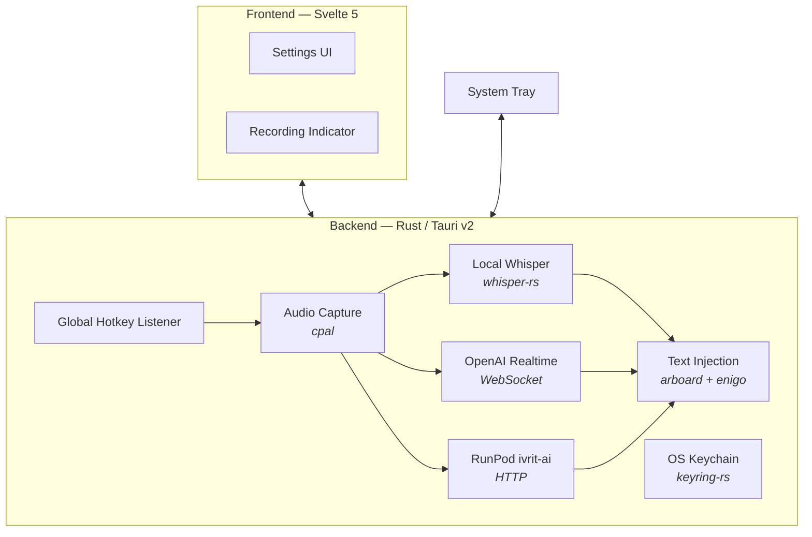

<p align="center">
  
</p>

<h1 align="center">AirType</h1>

<p align="center">
  Voice-to-text for your desktop — English &amp; Hebrew
</p>

<p align="center">
  <a href="#installation">Install</a> · <a href="#setup">Setup</a> · <a href="#usage">Usage</a> · <a href="#troubleshooting">Troubleshooting</a>
</p>

---

AirType is a lightweight desktop app that transcribes your voice and inserts the text at your cursor. Press a hotkey, speak, and the words appear wherever you're typing. Works system-wide across all applications.

## Features

- **Global hotkeys** — record from any application with a single keypress (customizable)
- **English and Hebrew** — dedicated hotkey and optimized model for each language
- **Two transcription engines:**
  - *Local Whisper* — free, offline, runs entirely on your machine
  - *Cloud API* — OpenAI Realtime for English, RunPod ivrit-ai for Hebrew
- **Floating indicator** — unobtrusive on-screen dot shows recording state
- **System tray** — runs in the background with near-zero resource usage
- **Auto-start** — optional launch on login
- **Secure storage** — API keys are kept in the OS keychain, never in config files

## Transcription Engines

### Cloud (API keys required)

| | English | Hebrew |
|---|---|---|
| **Service** | OpenAI Realtime API | RunPod Serverless (ivrit-ai) |
| **Model** | `gpt-4o-transcribe` | `ivrit-ai/whisper-large-v3-turbo-ct2` |
| **Mode** | Live — text streams as you speak | Batch — text appears after you stop |
| **Speed** | Real-time | ~2–5 s after recording stops |

### Local Whisper (free, offline)

| | English | Hebrew |
|---|---|---|
| **Model** | Selected Whisper model | Same model with Hebrew language hint |
| **Mode** | Batch | Batch |
| **Speed** | ~3–10 s depending on model size | ~3–10 s depending on model size |

### Recording modes

| Mode | Behavior |
|------|----------|
| **Hold** (default) | Hold the hotkey to record, release to stop |
| **Toggle** | Press once to start, press again to stop |

## Installation

### Prerequisites

**Linux (Ubuntu/Debian)**
```bash
sudo apt install -y \
    libgtk-3-dev libwebkit2gtk-4.1-dev libappindicator3-dev \
    librsvg2-dev patchelf libasound2-dev libssl-dev libxdo-dev \
    libdbus-1-dev pkg-config build-essential cmake
```

**macOS**
```bash
xcode-select --install
```

**Windows**
- [Visual Studio Build Tools](https://visualstudio.microsoft.com/visual-cpp-build-tools/)
- [CMake](https://cmake.org/download/)

### Build from source

```bash
git clone https://github.com/MatanelP/AirType.git
cd AirType
npm install
npm run tauri build
```

For development with hot reload:
```bash
npm run tauri dev
```

## Setup

### Local Whisper (free)

No configuration required. A Whisper model is downloaded automatically on first use. You can change the model size in Settings:

| Model | Download | Notes |
|-------|----------|-------|
| tiny | ~75 MB | Fastest, English only |
| base | ~150 MB | Default — good for English |
| **small** | **~466 MB** | **Recommended for English + Hebrew** |
| medium | ~1.5 GB | Better accuracy, slower |
| large | ~3 GB | Best accuracy, slowest |

### Cloud APIs

1. **OpenAI** (English, live transcription)
   - Create a key at [platform.openai.com/api-keys](https://platform.openai.com/api-keys)

2. **RunPod** (Hebrew)
   - Sign up at [runpod.io](https://runpod.io)
   - Deploy the ivrit-ai endpoint from the [RunPod console](https://www.runpod.io/console/hub/ivrit-ai/runpod-serverless)
   - Set Active Workers to 0 for scale-to-zero billing
   - Copy your API key and Endpoint ID

3. Open AirType Settings, select the cloud engine, and paste your keys. All secrets are stored in the OS keychain.

## Usage

1. Launch AirType — it appears in your system tray
2. Place your cursor where you want text inserted
3. Press your hotkey (default: `Ctrl+Shift+E` for English, `Ctrl+Shift+H` for Hebrew)
4. Speak naturally
5. The transcribed text is inserted at your cursor

Use the **Test** buttons in the main window to verify your API configuration.

## Architecture



### Tech stack

| Layer | Technology |
|-------|------------|
| Framework | [Tauri v2](https://tauri.app/) |
| Backend | Rust |
| Frontend | [Svelte 5](https://svelte.dev/) |
| Local STT | [whisper-rs](https://github.com/tazz4843/whisper-rs) (whisper.cpp bindings) |
| Live STT | [OpenAI Realtime API](https://platform.openai.com/docs/guides/realtime) |
| Hebrew STT | [ivrit-ai](https://huggingface.co/ivrit-ai/whisper-large-v3-turbo) via [RunPod](https://www.runpod.io/) |
| Audio | [cpal](https://github.com/RustAudio/cpal) |
| Text injection | [arboard](https://github.com/1Password/arboard) + [enigo](https://github.com/enigo-rs/enigo) |

## Troubleshooting

**Linux: Hotkeys not responding**
Wayland has limited global hotkey support. Run under X11 or XWayland.

**macOS: "AirType is damaged and can't be opened"**
The release builds are ad-hoc signed but not notarized. macOS may still block them after download. Clear the quarantine attribute:
```bash
xattr -cr /Applications/AirType.app
```
Then right-click the app and choose *Open*.

**macOS: Permission errors**
Go to System Settings → Privacy & Security and enable AirType under *Accessibility*, *Input Monitoring*, and *Microphone*.

**Model download fails or won't load**
Models are stored in the app config directory (`~/.config/airtype/models/` on Linux, `~/Library/Application Support/airtype/models/` on macOS). Try a smaller model first and check that you have sufficient disk space.

**Cloud transcription not working**
Verify your keys with the built-in test buttons. For OpenAI, confirm that billing is active. For RunPod, check that your endpoint has at least one max worker configured.

## License

MIT
