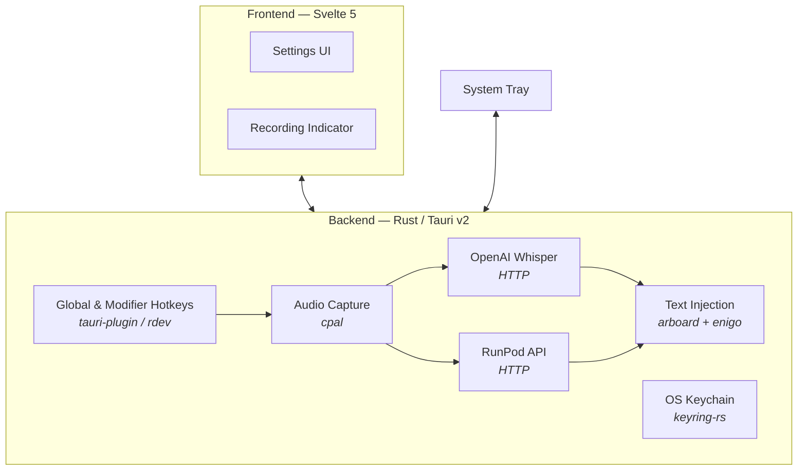

<p align="center">
  
</p>

<h1 align="center">AirType</h1>

<p align="center">
  Voice-to-text for your desktop — English &amp; Hebrew
</p>

<p align="center">
  <a href="#installation">Install</a> · <a href="#setup">Setup</a> · <a href="#usage">Usage</a> · <a href="#troubleshooting">Troubleshooting</a>
</p>

---

AirType is a lightweight desktop app that transcribes your voice and inserts the text at your cursor. Press a hotkey, speak, and the words appear wherever you're typing. Works system-wide across all applications.

## Features

- **Global hotkeys** — record from any application with a single keypress.
- **English and Hebrew** — dedicated hotkeys and endpoints configured for each language.
- **Customizable Cloud Endpoints** — dynamically route English to OpenAI or a Custom RunPod endpoint, while strictly routing Hebrew to the `ivrit-ai` model.
- **Floating indicator** — unobtrusive on-screen dot shows recording state.
- **System tray** — runs in the background with near-zero resource usage.
- **Auto-start** — optional launch on login.
- **Self-update** — checks GitHub releases on startup and installs signed updates in-app with one click.
- **Secure storage** — API keys are kept in the OS keychain, never in config files.

## Transcription Engines

AirType uses robust Cloud API endpoints to ensure the highest transcription quality. 

| Language | Default Endpoint | Alternative Endpoints | Mode |
|---|---|---|---|
| **Hebrew** | **RunPod** (ivrit-ai/whisper-large-v3-turbo-ct2) | — | Batch (~1-3s after stop) |
| **English** | **Same as Hebrew (RunPod)** | **OpenAI** (Whisper), **Custom RunPod** | Batch (~1-3s after stop) |

### Recording modes

| Mode | Behavior |
|------|----------|
| **Hold** (default) | Hold the hotkey to record, release to stop |
| **Toggle** | Press once to start, press again to stop |

## Installation

### Quick install (recommended)

**Linux / macOS**
```bash
curl -fsSL https://raw.githubusercontent.com/MatanelP/AirType/master/scripts/install.sh | sh
```

**Windows (PowerShell)**
```powershell
irm https://raw.githubusercontent.com/MatanelP/AirType/master/scripts/install.ps1 | iex
```

The script auto-detects your OS and architecture, downloads the correct release asset, installs it (using `apt`/`dnf` on Linux, `/Applications` on macOS, MSI on Windows), and on macOS strips the quarantine attribute so the ad-hoc signed bundle launches without Gatekeeper blocking it.

Pin a specific version by exporting `AIRTYPE_VERSION=v1.0.1` before running.

### Manual download

Grab the asset for your OS from the [Releases page](https://github.com/MatanelP/AirType/releases/latest):

- **Linux** — `.AppImage` (chmod +x and run), `.deb`, or `.rpm`
- **Windows** — `_x64-setup.exe` (NSIS) or `_x64_en-US.msi`
- **macOS (Apple Silicon)** — `_aarch64.dmg`

#### macOS: bypass the "app is damaged" warning

The macOS build is ad-hoc signed but not notarized (Apple's notary service requires a paid Developer account). After dragging AirType to Applications, run this one-liner to remove the quarantine attribute:

```bash
xattr -cr /Applications/AirType.app
```

Then launch normally. You only need to do this once. The quick-install script does this for you automatically.

### Build from source

#### Prerequisites

**Linux (Ubuntu/Debian)**
```bash
sudo apt install -y \
    libgtk-3-dev libwebkit2gtk-4.1-dev libappindicator3-dev \
    librsvg2-dev patchelf libasound2-dev libssl-dev libxdo-dev \
    libdbus-1-dev pkg-config build-essential cmake
```

**macOS**
```bash
xcode-select --install
```

**Windows**
- [Visual Studio Build Tools](https://visualstudio.microsoft.com/visual-cpp-build-tools/)
- [CMake](https://cmake.org/download/)

#### Build

```bash
git clone https://github.com/MatanelP/AirType.git
cd AirType
npm install
npm run tauri build
```

For development with hot reload:
```bash
npm run tauri dev
```

## Setup

### Endpoint Configuration

1. **RunPod (Hebrew)**
   - Sign up at [runpod.io](https://runpod.io)
   - Deploy the ivrit-ai endpoint from the [RunPod console](https://www.runpod.io/console/hub/ivrit-ai/runpod-serverless)
   - Set Active Workers to 0 for scale-to-zero billing
   - Copy your API key and Endpoint ID into AirType Settings

2. **OpenAI (Alternative English Endpoint)**
   - If the RunPod `ivrit-ai` model outputs English dictations using Hebrew script, you can easily separate your English endpoint.
   - Create an API key at [platform.openai.com/api-keys](https://platform.openai.com/api-keys)
   - Change **English Endpoint** to **OpenAI** in Settings and paste your key.

## Usage

1. Launch AirType — it appears in your system tray
2. Place your cursor where you want text inserted
3. Press your hotkey (default: `Ctrl+Shift+E` for English, `Ctrl+Shift+H` for Hebrew)
4. Speak naturally
5. The transcribed text is inserted at your cursor

Use the **Test** buttons in the main window to verify your API configuration.

## Architecture


```mermaid
graph TB
    subgraph Frontend ["Frontend — Svelte 5"]
        UI[Settings UI]
        Indicator[Recording Indicator]
    end

    subgraph Backend ["Backend — Rust / Tauri v2"]
        Hotkeys[Global & Modifier Hotkeys<br><i>tauri-plugin / rdev</i>]
        Audio[Audio Capture<br><i>cpal</i>]
        OpenAI[OpenAI Whisper<br><i>HTTP</i>]
        RunPod[RunPod API<br><i>HTTP</i>]
        Inject[Text Injection<br><i>arboard + enigo</i>]
        Keychain[OS Keychain<br><i>keyring-rs</i>]
    end

    Tray[System Tray]

    Hotkeys --> Audio
    Audio --> OpenAI
    Audio --> RunPod
    OpenAI --> Inject
    RunPod --> Inject
    Frontend <--> Backend
    Tray <--> Backend
```

### Tech stack

| Layer | Technology |
|-------|------------|
| Framework | [Tauri v2](https://tauri.app/) |
| Backend | Rust |
| Frontend | [Svelte 5](https://svelte.dev/) |
| APIs | Standard JSON HTTP Requests (`reqwest`) |
| Modifier Hotkeys | [rdev](https://github.com/Narsil/rdev) |
| Audio | [cpal](https://github.com/RustAudio/cpal) |
| Text injection | [arboard](https://github.com/1Password/arboard) + [enigo](https://github.com/enigo-rs/enigo) |

## Troubleshooting

**Linux: Hotkeys not responding**
Wayland has limited global hotkey support. Run under X11 or XWayland.

**macOS: "AirType is damaged and can't be opened"**
The release builds are ad-hoc signed but not notarized. macOS may still block them after download. Clear the quarantine attribute:
```bash
xattr -cr /Applications/AirType.app
```
Then right-click the app and choose *Open*.

**macOS: Permission errors**
Go to System Settings → Privacy & Security and enable AirType under *Accessibility*, *Input Monitoring*, and *Microphone*. (Note: `rdev` requires Input Monitoring for single-modifier hotkeys).

**Cloud transcription not working**
Verify your keys with the built-in test buttons. For OpenAI, confirm that billing is active. For RunPod, check that your endpoint has at least one max worker configured.

## Updates

AirType updates itself using the [Tauri updater](https://tauri.app/plugin/updater/). On launch it checks
`https://github.com/MatanelP/AirType/releases/latest/download/latest.json`; if a newer signed version is
published, a banner appears in the main window with an **Install & Restart** button. You can also trigger a
check manually from **Settings → Updates → Check now**, or disable the startup check there.

Updates are cryptographically verified against the public key embedded in `tauri.conf.json` — an update that
isn't signed with the matching private key is rejected.

### Releasing (maintainers)

Updates only work if the release artifacts are **signed** and accompanied by a `latest.json` manifest. The CI
workflow (`.github/workflows/build.yml`) does both automatically on a `v*` tag, but it needs the signing
keypair provided as repository secrets:

| Secret | Value |
|---|---|
| `TAURI_SIGNING_PRIVATE_KEY` | Contents of the private key file generated by `npx tauri signer generate` |
| `TAURI_SIGNING_PRIVATE_KEY_PASSWORD` | The key's password (leave empty if generated without one) |

To cut a release:

1. Bump the version in `package.json`, `src-tauri/Cargo.toml`, and `src-tauri/tauri.conf.json`.
2. Tag and push: `git tag v1.2.0 && git push origin v1.2.0`.
3. CI builds every platform, signs the updater artifacts (`.sig`), generates `latest.json`, and attaches
   everything to the GitHub release. Existing installs pick it up on their next launch.

> **Keep the private key safe.** If it's lost, you can't sign updates and the pubkey in `tauri.conf.json`
> must be rotated (which breaks updates for already-installed clients until they reinstall).

## License

MIT
